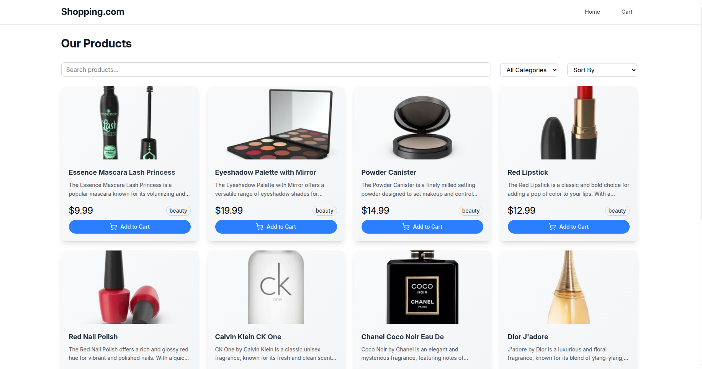
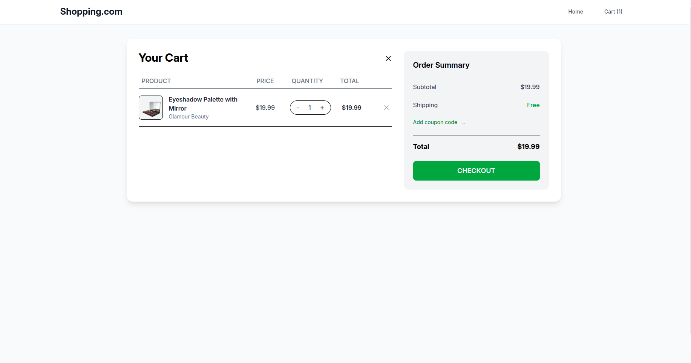
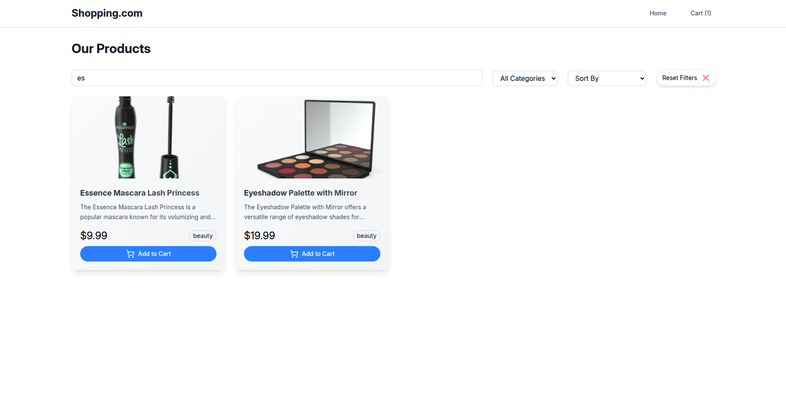

# 🛍️ Vue E-commerce App

A modern e-commerce frontend built with **Vue 3**, featuring product listings, filters, a shopping cart, and product detail modals. This application demonstrates scalable state management with Vuex, smooth navigation using Vue Router, and elegant icons from lucide-vue-next.

---

## 📦 Tech Stack

- **Vue 3**
- **Vite**
- **Vue Router 4**
- **Vuex 4**
- **TailwindCSS**
- **lucide-vue-next** (for modern SVG icons)

---

## 🚀 Features

- ✅ Product listing with image, price, title, and hover effects
- ✅ Filter by category, search, and sort by name/price
- ✅ Responsive design with clean UI using TailwindCSS
- ✅ Product detail shown in a modal for quick view
- ✅ Shopping cart with item count and price summary
- ✅ Debounced search input and filter reset support

---

## 🖼️ Screenshots

| Product Listing                  | Cart Sidebar             |
| -------------------------------- | ------------------------ |
|  |  |

| Product Detail Modal                     | Filter Controls                |
| ---------------------------------------- | ------------------------------ |
|  |  |

---

## 🔧 Requirements

- **Node.js**: `v20.19.2`
- **npm**: `11.2.0`

---

## 📁 Project Setup

```bash
npm install
npm run dev
```

## 🚀 Run the App with Docker

### Using Docker CLI

Build the Docker image:

```bash
docker build -t your-app-name .
docker run -d -p 3000:5173 your-app-name
```

### Using Docker Compose

```bash
docker compose up --build
```
